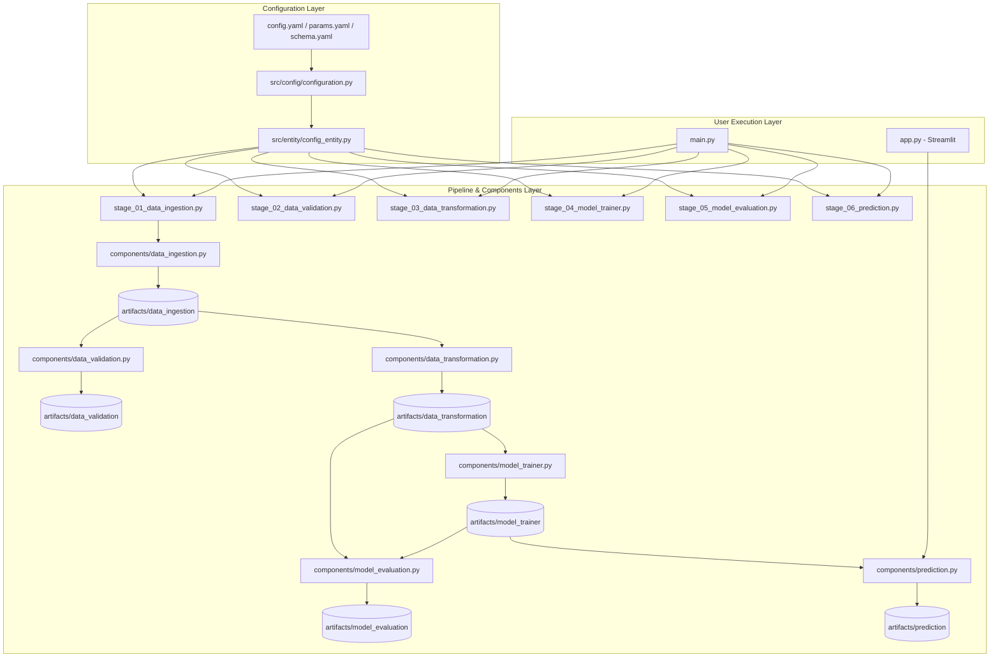

# GIẢI THÍCH CHI TIẾT CẤU TRÚC DỰ ÁN HỆ THỐNG DỰ BÁO THỜI TIẾT (MLOps Pipeline)

Tài liệu này giải thích chi tiết lý do xuất hiện, mục đích và nguyên lý hoạt động của từng thư mục và tệp tin trong dự án **Weather** theo chuẩn kiến trúc **MLOps (Machine Learning Operations)**.

---

## 1. TẠI SAO LẠI CẦN CẤU TRÚC NÀY? (Triết lý thiết kế)

Khi làm một bài toán Machine Learning nhỏ, bạn có thể viết tất cả code từ lấy dữ liệu, xử lý, huấn luyện đến dự báo trong một file Python duy nhất (hoặc file Jupyter Notebook). Tuy nhiên, cách làm đó có các nhược điểm lớn:
- **Khó bảo trì:** Code bị lộn xộn, dài hàng ngàn dòng, rất khó sửa lỗi.
- **Rò rỉ dữ liệu / Lỗi đường dẫn:** Đường dẫn file bị viết cứng (hardcode) khắp nơi.
- **Khó làm việc nhóm & Tự động hóa:** Không thể chạy tự động từng phần hoặc tái sử dụng mã nguồn.

**Giải pháp:** Kiến trúc **Configuration-Driven MLOps Pipeline** chia dự án thành các tầng độc lập:
1. **Cấu hình (Config):** Tách riêng mọi tham số và đường dẫn file ra ngoài.
2. **Định nghĩa (Entity):** Chuẩn hóa kiểu dữ liệu cấu hình.
3. **Thực thi (Components):** Mỗi file chỉ làm duy nhất 1 việc chuyên biệt.
4. **Điều phối (Pipeline):** Kết nối các bước theo thứ tự.
5. **Giao diện/Vận hành (Main/App):** Điểm kích hoạt chương trình và hiển thị cho người dùng.

---

## 2. CHI TIẾT TỪNG THƯ MỤC & TỆP TIN

```text
Weather/
├── config/                  # [TẦNG CẤU HÌNH TĨNH]
│   ├── config.yaml          # Định nghĩa vị trí lưu trữ sản phẩm (artifacts) của từng bước
│   ├── params.yaml          # Định nghĩa siêu tham số mô hình (VD: số cây trong Random Forest)
│   ├── schema.yaml          # "Bản hợp đồng" quy định tên cột và kiểu dữ liệu chuẩn
│   └── logging.yaml         # Quy định cách in log ra màn hình và lưu file nhật ký
│
├── artifacts/               # [TẦNG SẢN PHẨM TRUNG GIAN - TỰ ĐỘNG SINH RA]
│   ├── data_ingestion/      # Chứa file CSV dữ liệu lịch sử tải về từ API
│   ├── data_validation/     # Chứa file status.txt xác nhận dữ liệu đạt chuẩn hay không
│   ├── data_transformation/ # Chứa file train.csv và test.csv sau khi tạo đặc trưng
│   ├── model_trainer/       # Chứa mô hình đã huấn luyện (.joblib)
│   ├── model_evaluation/    # Chứa file metrics.json lưu độ chính xác (MAE, RMSE, R2)
│   └── prediction/          # Chứa file dự báo kết quả thời tiết ngày mai
│
├── logs/                    # [TẦNG NHẬT KÝ]
│   └── app.log              # Lưu toàn bộ vết chạy chương trình kèm thời gian & lỗi
│
├── src/                     # [TẦNG MÃ NGUỒN CHÍNH]
│   ├── __init__.py          # Đánh dấu src là một Python Package
│   │
│   ├── utils/               # Công cụ bổ trợ dùng chung cho toàn bộ dự án
│   │   ├── __init__.py
│   │   ├── logger.py        # Khởi tạo logger để ghi nhận lịch sử ứng dụng
│   │   └── common.py        # Các hàm tiện ích: đọc file YAML, tạo thư mục, lưu file JSON/binary
│   │
│   ├── entity/              # Định nghĩa cấu trúc lớp dữ liệu
│   │   ├── __init__.py
│   │   └── config_entity.py # Dùng dataclasses để quy định kiểu dữ liệu cấu hình cho từng bước
│   │
│   ├── config/              # Quản lý và cung cấp cấu hình cho ứng dụng
│   │   ├── __init__.py
│   │   └── configuration.py # Lớp ConfigurationManager đọc các file YAML và trả về ConfigEntity
│   │
│   ├── components/          # Các bộ phận thực thi chuyên biệt (Core Logic)
│   │   ├── __init__.py
│   │   ├── data_ingestion.py      # Tải dữ liệu thời tiết lịch sử từ Open-Meteo API
│   │   ├── data_validation.py     # Đọc schema.yaml và kiểm tra tính toàn vẹn của dữ liệu
│   │   ├── data_transformation.py # Tiền xử lý, tạo lag/rolling features, chia tập train/test
│   │   ├── model_trainer.py        # Huấn luyện mô hình Random Forest và lưu file .joblib
│   │   ├── model_evaluation.py     # Đánh giá độ chính xác trên tập test và lưu metrics.json
│   │   └── prediction.py           # Gọi API thời tiết hiện tại và dùng mô hình dự báo ngày mai
│   │
│   └── pipeline/            # Điều phối và kết nối các bước
│       ├── __init__.py
│       ├── stage_01_data_ingestion.py
│       ├── stage_02_data_validation.py
│       ├── stage_03_data_transformation.py
│       ├── stage_04_model_trainer.py
│       ├── stage_05_model_evaluation.py
│       └── stage_06_prediction.py
│
├── requirements.txt         # Khai báo tất cả thư viện Python cần dùng cho dự án
├── main.py                  # Script điều khiển chạy toàn bộ Pipeline từ Stage 01 -> Stage 06
└── app.py                   # Giao diện Web tương tác trực quan dựng bằng Streamlit
```

---

## 3. SƠ ĐỒ LUỒNG DỮ LIỆU VÀ SỰ KẾT NỐI (Data Flow)



---

## 4. TÓM TẮT LỢI ÍCH CỦA TỪNG PHẦN

1. **`config/`**: Nơi bạn thay đổi mọi thiết lập mà **không cần đụng tới 1 dòng code Python**.
2. **`artifacts/`**: Nơi kiểm tra sản phẩm trung gian của từng giai đoạn (dữ liệu thô -> dữ liệu sạch -> mô hình -> kết quả).
3. **`src/utils/`**: Giúp loại bỏ việc viết lặp đi lặp lại mã nguồn đọc/ghi file hay khởi tạo log.
4. **`src/components/`**: Nơi chứa thuật toán chính. Khi muốn thay đổi thuật toán huấn luyện hay cách tạo đặc trưng, bạn chỉ cần mở file trong thư mục này.
5. **`src/pipeline/`**: Nơi đóng gói từng bước thành 1 khối module có hàm `main()`, giúp `main.py` chỉ cần gọi lần lượt từng bước một cách ngắn gọn.
6. **`app.py`**: Giao diện người dùng cuối, chỉ giao tiếp với module dự báo `prediction.py` để lấy kết quả hiển thị.
