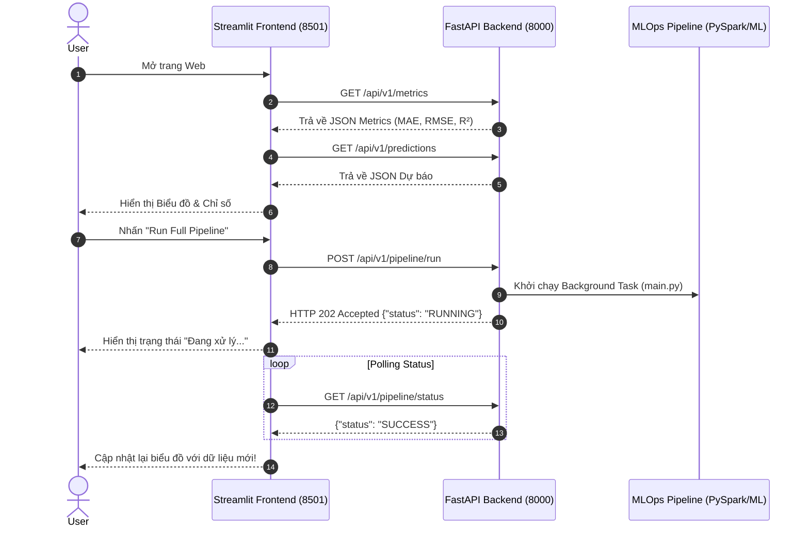

# 🌤️ Automated Weather Forecast Bias Correction System (TP. Hồ Chí Minh)

[](https://www.python.org/)
[](https://spark.apache.org/)
[](https://fastapi.tiangolo.com/)
[](https://streamlit.io/)
[](https://www.docker.com/)

Hệ thống **MLOps Pipeline** hoàn chỉnh tự động thu thập dữ liệu thời tiết, trích xuất đặc trưng với **PySpark**, huấn luyện mô hình Machine Learning (**RandomForestRegressor**) để **hiệu chỉnh sai số dự báo nhiệt độ** (Bias Correction) tại khu vực **TP. Hồ Chí Minh**, và phục vụ người dùng thông qua kiến trúc **Decoupled Web (FastAPI Backend + Streamlit Frontend)**.

---

## 📌 1. Bối Cảnh & Mục Tiêu Dự Án

Dự báo thời tiết từ các dịch vụ toàn cầu (như Open-Meteo) thường gặp địa phương hóa sai số (bias) do đặc thù vi khí hậu của TP. Hồ Chí Minh (khí hậu nhiệt đới gió mùa, hiệu ứng đảo nhiệt đô thị).

### 🎯 Mục Tiêu Hệ Thống:
1. **Tự động thu thập dữ liệu**: Lấy dữ liệu lịch sử thực tế (Archive) và dữ liệu dự báo 7 ngày tới cho TP.HCM.
2. **Xử lý dữ liệu lớn (Big Data)**: Sử dụng **PySpark DataFrame Engine** để tính toán Lag Features (1-3 ngày), Rolling Mean/Std (3d, 7d) và Seasonality (mùa trong năm).
3. **Hiệu chỉnh sai số ML**: Huấn luyện mô hình `RandomForestRegressor` dự đoán mức độ sai biệt ($\Delta_{temp} = y_{actual} - y_{raw\_forecast}$) giúp làm giảm MAE/RMSE đáng kể.
4. **Kiến trúc Web Tách biệt (Decoupled Architecture)**: Phục vụ API bất đồng bộ thông qua **FastAPI** và hiển thị biểu đồ tương tác trực quan trên **Streamlit**.

---

## 🏗️ 2. Kiến Trúc Hệ Thống (System Architecture)

```text
[ User Browser ]
       │
       ▼ (Port 8501)
┌─────────────────────────────────────────┐
│           FRONTEND SERVICE              │
│       Streamlit Dashboard (app.py)      │
└────────────────────┬────────────────────┘
                     │ HTTP REST API Request (JSON)
                     ▼ (Port 8000)
┌─────────────────────────────────────────┐
│            BACKEND SERVICE              │
│         FastAPI Web Server (src/api)    │
├─────────────────────────────────────────┤
│  Endpoints:                             │
│   • GET  /health                        │
│   • GET  /api/v1/metrics                │
│   • GET  /api/v1/predictions            │
│   • POST /api/v1/pipeline/run           │
│   • GET  /api/v1/pipeline/status        │
└────────────────────┬────────────────────┘
                     │ Triggers
                     ▼
┌─────────────────────────────────────────┐
│     MLOps Pipeline (src/pipeline/*)     │
│  Stage 01: Data Ingestion (Open-Meteo)  │
│  Stage 02: Data Validation (Schema)     │
│  Stage 03: PySpark Data Transformation  │
│  Stage 04: Bias Correction Model Trainer│
│  Stage 05: Model Evaluation (Metrics)   │
│  Stage 06: Online Prediction (Forecast) │
└─────────────────────────────────────────┘
```

### 🔄 2.1. Luồng Giao Tiếp Chi Tiết (Sequence Flow)



---

## 📁 3. Cấu Trúc Thư Mục Dự Án (Project Layout)

Cấu trúc thư mục được thiết kế theo chuẩn MLOps Modularization (tham khảo từ [customer_churn_prediction](https://github.com/Ducdata1808/customer_churn_prediction)):

```text
Weather/
├── backend/                    # [FastAPI REST API Server]
│   ├── app/
│   │   ├── __init__.py
│   │   └── main_api.py        # Các REST API Endpoints & Background Tasks
│   └── requirements.txt        # Thư viện cho Backend
├── frontend/                   # [Streamlit Web UI]
│   ├── app.py                 # Streamlit Dashboard giao tiếp qua REST API
│   └── requirements.txt        # Thư viện cho Frontend
├── src/                        # [Core MLOps Engine]
│   ├── components/             # Chi tiết thực thi 6 Stage MLOps
│   │   ├── data_ingestion.py
│   │   ├── data_validation.py
│   │   ├── data_transformation.py (PySpark)
│   │   ├── model_trainer.py
│   │   ├── model_evaluation.py
│   │   └── prediction.py
│   ├── config/                 # Configuration Manager
│   ├── entity/                 # Dataclasses cấu hình
│   ├── pipeline/               # 6 Pipeline Stage Wrappers
│   └── utils/                  # Logger & Common Helper Utilities
├── config/                     # [Cấu hình YAML]
│   ├── config.yaml            # Định nghĩa đường dẫn artifacts
│   ├── params.yaml            # Hyperparameters mô hình & PySpark
│   ├── schema.yaml            # Định nghĩa kiểu dữ liệu cột
│   └── logging.yaml           # Cấu hình Logging
├── tests/                      # [Kiểm thử Tự động Pytest]
│   └── test_api.py             # Test cases cho Backend API Endpoints
├── artifacts/                  # Sản phẩm trung gian sinh ra từ Pipeline
├── logs/                       # Nhật ký ghi vết ứng dụng
├── main.py                     # Entrypoint chạy toàn bộ 6 Stage qua CLI
├── Dockerfile.backend          # Build image Backend (Python 3.10 + OpenJDK 17)
├── Dockerfile.frontend         # Build image Frontend (Streamlit UI)
├── docker-compose.yml          # Điều phối 2 container với Docker Compose
├── Makefile                    # Lệnh phím tắt tiện lợi cho Developer
├── setup.py                    # Cài đặt src dưới dạng Python Package
└── requirements.txt            # Dependencies tổng thể dự án
```

---

## 🔄 4. Quy Trình 6 Stage MLOps Pipeline

1. **Stage 01 — Data Ingestion**: Tự động tải dữ liệu từ Open-Meteo API (Quá khứ 1,300+ dòng & Dự báo 7 ngày 108 dòng) lưu tại `artifacts/data_ingestion/`.
2. **Stage 02 — Data Validation**: Kiểm tra tính toàn vẹn dữ liệu và kiểu dữ liệu so với `config/schema.yaml`, xuất `status.txt`.
3. **Stage 03 — Data Transformation (PySpark)**: Khởi tạo SparkSession, thực hiện Feature Engineering (Lag, Rolling Mean/Std, Month/Day Seasonality) và phân chia Train/Test Parquet datasets.
4. **Stage 04 — Model Trainer**: Huấn luyện mô hình `RandomForestRegressor` dự đoán sai số nhiệt độ cao nhất, lưu model `bias_correction_model.joblib`.
5. **Stage 05 — Model Evaluation**: Đánh giá MAE, RMSE, R² trước và sau hiệu chỉnh, lưu báo cáo JSON tại `artifacts/model_evaluation/metrics.json`.
6. **Stage 06 — Online Prediction**: Áp dụng mô hình đã huấn luyện để hiệu chỉnh sai số cho 7 ngày tiếp theo tại TP.HCM, xuất `artifacts/prediction/forecast_corrected.json`.

---

## 🌐 5. Danh Sách REST API Endpoints (Backend)

| Method | Endpoint | Mô tả |
| :--- | :--- | :--- |
| `GET` | `/health` | Kiểm tra sức khỏe dịch vụ Backend (Status 200 OK) |
| `GET` | `/api/v1/metrics` | Lấy các chỉ số đánh giá mô hình (MAE, RMSE, R²) |
| `GET` | `/api/v1/predictions` | Lấy danh sách dự báo nhiệt độ đã hiệu chỉnh ML |
| `POST` | `/api/v1/pipeline/run` | Kích hoạt chạy 6 Stage Pipeline ngầm (Background Task) |
| `GET` | `/api/v1/pipeline/status` | Lấy trạng thái thực thi pipeline (`IDLE`, `RUNNING`, `SUCCESS`, `FAILED`) |

---

## ⚡ 6. Hướng Dẫn Cài Đặt & Khởi Chạy

### Yêu Cầu Tiên Quyết (Prerequisites)
- **Python**: `>= 3.10`
- **Java Runtime**: `OpenJDK 17` (yêu cầu bởi PySpark Engine)
- **Docker & Docker Compose** (nếu muốn đóng gói container)

---

### Cách 1: Khởi Chạy Cục Bộ (Development Mode)

1. **Khởi tạo môi trường & cài đặt thư viện**:
   ```bash
   pip install -r requirements.txt
   pip install -e .
   ```

2. **Chạy Backend REST API (Port 8000)**:
   ```bash
   make backend
   ```
   *Tài liệu Swagger API Interactive xem tại: [http://localhost:8000/docs](http://localhost:8000/docs)*

3. **Chạy Frontend Web UI (Port 8501)**:
   ```bash
   make frontend
   ```
   *Mở Dashboard trên trình duyệt tại: [http://localhost:8501](http://localhost:8501)*

4. **Chạy Pipeline trực tiếp qua CLI**:
   ```bash
   make pipeline
   ```

---

### Cách 2: Khởi Chạy Bằng Docker Compose (Production Mode)

Chạy toàn bộ Backend (FastAPI + PySpark) và Frontend (Streamlit) chỉ với 1 câu lệnh:

```bash
# Khởi chạy các container ngầm
make docker-up

# Xem log hoạt động real-time
docker compose logs -f

# Dừng hệ thống container
make docker-down
```

---

## 🧪 7. Kiểm Thử Tự Động (Automated Testing)

Chạy bộ kiểm thử pytest cho các API endpoints:

```bash
make test
```

Kết quả mong đợi:
```text
tests/test_api.py::test_health_check PASSED                              [ 25%]
tests/test_api.py::test_get_pipeline_status PASSED                       [ 50%]
tests/test_api.py::test_get_metrics PASSED                               [ 75%]
tests/test_api.py::test_get_predictions PASSED                           [100%]
```
